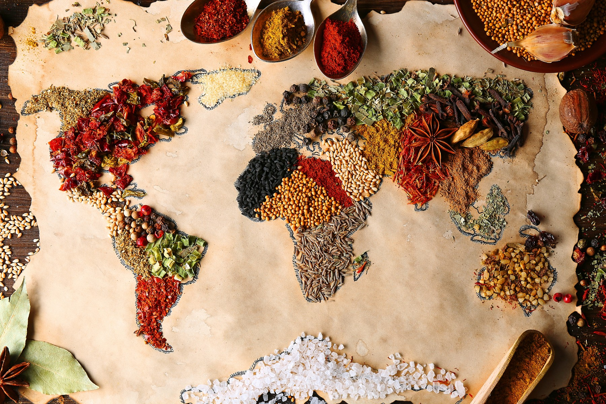
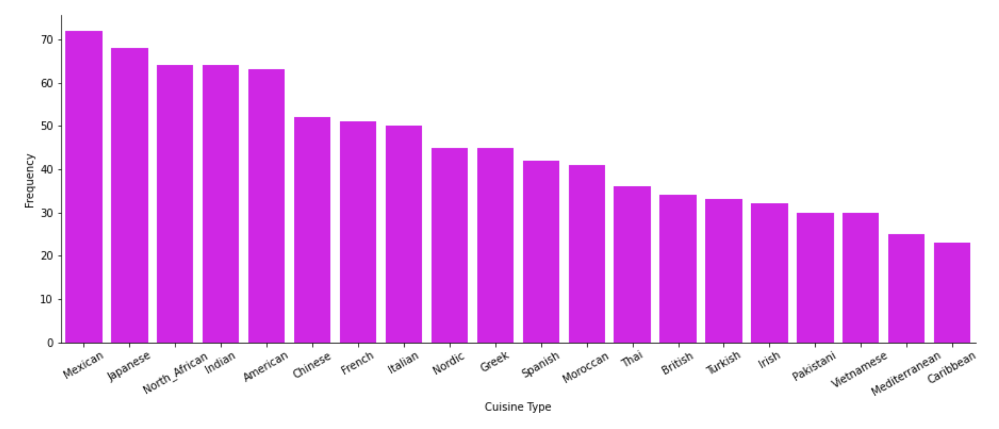
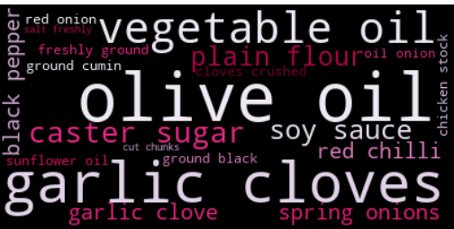
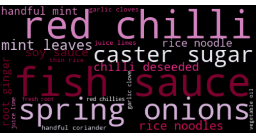

# Cuisine_Classification_Capstone
By: Ijeoma N. Akamnonu

## Business Problem
Build a model that can accurately classify a cuisine based on key words in a given recipe.
WHY?
Gain insights and make patterns between different cuisines through classification
Use those insights and patterns to generate novel, possibly delicious recipes

## Data
The data used for this classification project was scrapped and concatenated from 2 different websites, both of which are affilitated with [British Broadcasting Corporation](https://www.bbc.com/). 900 recipes were collected in total from [BBC Good Food](https://www.bbcgoodfood.com/recipes/category/all-cuisines) and [BBC Food](https://www.bbc.co.uk/food/cuisines). 

When we first take a look at our data, we can see the distribution of class that we have. 

**Cuisines Class Distribution**

From the bar graph above, we can clearly see that a majority of our data consists of mexican recipes and comparitavelty there is a severe lack of caribbean recipes. Through further exploratory data analysis, we can generate more insights about our data. 
### Insights

Looking at a couple wordclouds below:

Above is a wordcloud using all words, excluding custom or nltk stopwords. From this image alone we can make a few assumptions about our data. One is that most recipes seem to use an oil of some kind and garlic. If we remove these terms, we may be able to help our model distinguish between recipes and cuisines. This kind of analysis can be done for each and every recipe. As you can see in the example cuisine wordcloud from Vietnamese cusine, we would be able to thoroughly clean our data so the model has the simplest ingredients data to work with.

Some obvious insights we can make from this is that Vietnamese cuisine heavily utilizes fish sauce and red chilli (most likely oil or sauce).

## Methods and Results
### EDA
To assist in exploratory data analysis, I used Regular Expressions to tokenize my ingredients, stemming and lemming to simplify my tokens, as well as WordCloud, Matplotlib and Seaborn to visualize my findings. 

### Modeling
**Model 1: Random Forest**

Random Forest with Normal Features

Testing Accuracy: 0.55

F1 Score: 0.5204

Random Forest with Lemmatization Features

Testing Accuracy: 0.5667

F1 Score: 0.5405

Random Forest with Stemmed Features

Testing Accuracy: 0.55

F1 Score: 0.5212

From the first model, we can already conclude that Random Forest may not be the best algorithm to use. Also, since lemmatized features performed the best, I will lemmetize my data for the other models. Another part of next steps could be exploring other possiblities with stemming. 

**Model 2: SVM: Stochastic Gradient Descent**

accuracy: 0.64      
macro avg: 0.58     
weighted avg: 0.63 

**Model 3: Naieve Bayes**

accuracy: 0.47555555555555556

**Model 4: Logistic Regression**

accuracy: 0.62       
macro avg: 0.57       
weighted avg: 0.61  

## Conclusions
From all the models we used, it looks like Stochastic Gradient Descent with SVM gave us the best model with an accuracy score of 64%. Though it is not the gratest score for a classification model, it is pretty good for a model with 20 that contains classes.  

# Next Steps 
### More Data Collection
1. Collecting more data is always a great way to enchance any model 
2. More data will lead to more, better features to help our model
3. Meticulous remove more useless stopwords (further data cleaning)
4. From more cleaning, generate more insights to, again, help our model
### Neural Networks
After bettering what our model has to work with and optimizing it to get the best F1 or accuracy score, we can move onto the creating a handy web app.
1. Implement Naural Language Generation with the use of Markovify
2. Utilize StreamLit to launch a simple web app that can take in a list of ingredients and out put a novel recipe

## Helpful Sources
1. j-gilkey's [recipes_nlp repository](https://github.com/j-gilkey/recipes_nlp)
2. Jamie Cheng's [Predicting Cuisine Regionality Based on Recipe Ingredients using NLP](https://medium.com/@jaimejcheng/predicting-cuisine-regionality-based-on-recipe-ingredients-using-nlp-5262e83884eb)
3. Monkey Learn's blog on [Classification Algorithms in Machine Learning: How They Work](https://monkeylearn.com/blog/classification-algorithms/)